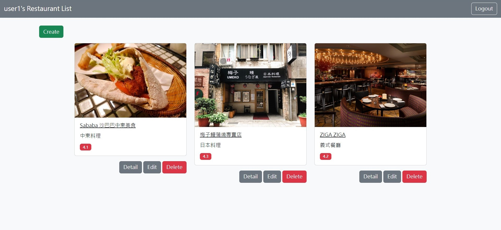

# restaurant-list

## 介紹
餐廳收藏應用程式。用戶可以註冊帳號並開始新增、瀏覽、編輯、刪除餐廳。

### 功能

+ 用戶認證系統可自行註冊或以臉書登入
+ 查看所有餐廳
+ 新增餐廳
+ 瀏覽餐廳明細
+ 編輯餐廳
+ 刪除餐廳

## 啟用專案
1. 請確認本地端已安裝 Node.js 和 npm
2. 將此專案clone到本地端
3. 安裝相關套件
npm install
4. 參考env.example建立.env
5. 資料庫連線完成後新增種子資料
npm run seed
此步驟將產生兩組用戶資料
1. 用戶一
email user1@example.com
password 12345678

2. 用戶二
email user2@example.com
password 12345678
6. 運行專案
npm run start
若有安裝nodemon可使用以下指令運行專案
npm run dev

## 開發工具
+ bcryptjs 2.4.3
+ body-parser 1.19.0
+ connect-flash 0.1.1
+ express 4.17.1
+ express-handlebars 4.0.3
+ express-session 1.17.1
+ method-override 3.0.0
+ mongoose 5.9.7
+ passport 0.4.1
+ passport-facebook 3.0.0
+ passport-local 1.0.0
+ dotenv 16.3.1
